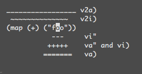

# VIM
## Basic Usage
### Normal Mode:
* First Open file with VIM command, with get into Normal Mode
* `h``j``k``l` : `←``↓``↑``→`
* `dd` : delete current line
* `x` : delete current character
* `yy` : copy current line
* `p` : paste. It will paste last copied, cut or deleted texts.
* `^` : go to first non-blank character in current line, `$` to the end
* `u` : undo, `<C-r>` : redo. `g-`/`g+` : go to older/newer text state
* `.` : repeat last action
* `N<command>` : repeat `Command` `N` times. For example, `2dd` : delete two line
* `gg`: go to first line, `G` : Go to last line, `NG` : Go to line `N` (`N` stands for a number, for example, `10G`)
* `w` : move cursor to the beginning of next word, `e` : move cursor to the end of next word
* `%` : match the closest `{`, `[`, `(`
* `*` : search forward for the occurrence of the word nearest to the cursor., `#` : search backward.

### Insert Mode:
* `i` : Get into Insert Mode, `Esc` back to Normal Mode
* `I` : Start to insert text at the beginning of the current line
* `o` : Begin a new line below the cursor and insert text
* `O` : Begin a new line above the cursor and insert text

### Command Mode:
* Execute command (`:`), search patterns
(`/` and `?`), and filter commands (`!`)
* `:wq` : Save then quit, `:q`: Quit, `:w`: Save, `:q!`: Quit current file without saving, `:qa!` Quit all files without saving
* `:e <path/to/file>` : Open another file
* `:saveas <path/to/file>` : Save as another file

## Advance Usage

### Insert Mode:
* `gi` : goto Insert mode where you left it last time

### Normal Mode:
* `<C-y>`, `<C-e>` : check the text above or below the cursor
* `<C-w>w` : Switch windows between last one and current one
* `<C-w><dir>` : `<dir>` can be `h``j``k``l`, switch windows to left, down, up or right.
* to move at current line
    * `0` → head
    * `^` → non-blank head
    * `$` → end
    * `g_` → non-blank end
    * `fa` → to next character `a`
    * `t,` → to the character right before the next `,`
    * `3fa` → to the third `a`
    * `F`, `T` → same as `f`, `t` with reverse direction

        

* manipulate a text block `<C-v>`, for example:

    * add prefixes to multi lines

        
`
        * `^` → to the head of the line
        * `<C-v>` → Start to select a block of text
        * `<C-d>` → to move downward, you also can use `h``j``k``l` or `%` instead
        * `I--`  → Insert `--`
        * `[ESC]` → to make effects to every line

    * append text to multi lines

        

        * `<C-v>` → Choose lines (You can also use `j`, `<C-d>`, `/pattern`, `%`, etc.
        * `$` → move cursor to the end
        * `A` → start to input text, type press `ESC`

    * indentation

        

        * `J` → convert multi lines to single line
        * `<` `>` → indent to left or right
        * `=` → auto indent

### Visual Mode:
* Block Choosing `<action>a<object>` or `<action>i<object>`
    * `<action>` can be any actions, like `d`(delete), `y`(copy), `v`(text selecting).
    * `<object>` can be `w`(a word), `W`(a phrase), `s`(a sentance), `p`(a paragraph), or a special symbol like `"`, `'`, `)`, `}`, `]`.
    * For example:

       

        * `vi"` → foo
        * `va"` → "foo"
        * `vi)` → "foo"
        * `va)` → ("foo")
        * `v2i)` → map (+) ("foo")
        * `v2a)` → (map (+) ("foo"))

### Command Mode:
* `:split` : split window horizontally, `:vsplit` : split window vertically.
* `q` : Record typed characters into register, then repeat them.
    * `qa` : record every action into register `a`
    * `@a` : replay it
    * `@@` : to replay the latest register
    * For example:

        

        * In this text file, only have "1" in it, start to input: `qaYp<C-a>q`

            * `qa` → start to record
            * `yyp` → copy current line to next line
            * `<C-a>` → add 1
            * `q` → stop recording
            * `@a` → write down 2 under 1
            * `@@` → write down 3 under 2
            * `100@@` → repeat it 100 times.
* `:[range]s/<pattern>/<replace>/{flags}` : replace text
    * TODO
    * `[range]`

## Plugins

### Explanations of Important Keywords
* `<Leader>`: default is `\`, you can change it by using `let mapleader = ','` in `.vimrc` file.
* `<CR>`: equals `<Return>`	\& `<Enter>`
* `<S-...>`	: shift-key
* `<C-...>`: control-key
* `<M-...>` & `<A-...>`: alt-key
* `<D-...>`: command-key (Mac only)
* `g:`: means globally. Example:
    * `let g:last_active_tab = 1` toggle switch between current tab and the last one globally.
* `remap`: Allows for mappings to work recursively.
* `noremap`: Only a single entry. Can NOT be remapped.
* `n` & `v` & `s` & `i`: prefixes, `n` stands for Normal mode, `v` stands for Visual mode, `s` stands for Select Mode, `i` stands for Insert Mode. Example:
    * `nnoremap <C-t> :tabnew<CR>`: remap `Ctrl + t` to create a new tab
    * `inoremap <C-t> <Esc>:tabnew<CR>`: same as last one, with an escape action additionally.
* `<Plug>`: in `.vimrc` file, it has two meanings. First, it's visible out of the plugin scripts. And the second, use structure `<Plug> scriptname mapname` to avoid confliction with other plugins. For example: `<Plug>TypecorrAdd`, `Typecorr` is the script name, and `Add` is the function name.
* `<SID>`: is the script ID and not visible outside. Compare with `<Plug>`, it's more like `private` function to other scrips. So can't use it out of the script. Example:

  ```vim
  " ,en ,ep to jump between errors
  function! <SID>LocationPrevious()
    try
        lprev
    catch /^Vim\%((\a\+)\)\=:E553/
        llast
    endtry
  endfunction

  function! <SID>LocationNext()
    try
        lnext
    catch /^Vim\%((\a\+)\)\=:E553/
        lfirst
    endtry
  endfunction

  nnoremap <silent> <Plug>LocationPrevious :<C-u>exe 'call <SID>LocationPrevious()'<CR>
  nnoremap <silent> <Plug>LocationNext :<C-u>exe 'call <SID>LocationNext()'<CR>
  nmap <silent> <Leader>ep <Plug>LocationPrevious
  nmap <silent> <Leader>en <Plug>LocationNext
  ```

* `<silence>`:  to make a key mapping can`t be echoed on the command line
* `<expr>` take the argument as expression. For example: `inoremap <expr> <C-L> ListItem()`, ListItem is a function which is mapped with `Ctrl + L`.

### unblevable/quick-scope

* Github Repo: [unblevable/quick-scope](https://github.com/unblevable/quick-scope)
* Useage: highlights which characters to target for `f`, `F` and family.
* Key Mapping:

      let g:qs_highlight_on_keys = ['f', 'F', 't', 'T'] //

### ntpeters/vim-better-whitespace

* Github Repo: [ntpeters/vim-better-whitespace](ntpeters/vim-better-whitespace)
* Useage: clean extra whitespace.
* Key Mapping:

      nnoremap <silent> <Leader><Space> :StripWhitespace<CR>
      autocmd FileType c,cpp,java,go,php,javascript,puppet,python,rust,twig,xml,yml,perl autocmd BufWritePre <buffer> StripWhitespace
      let g:better_whitespace_filetypes_blacklist=['diff', 'gitcommit', 'unite', 'qf', 'help']

### Vim-CtrlSpace
* Github Repo: [vim-ctrlspace/vim-ctrlspace](https://github.com/vim-ctrlspace/vim-ctrlspace)
* Useage:
    * bookmarks for your favorite projects
    * workspaces (sessions)
    * tabs / buffers / files management
    * fast fuzzy searching powered by Go
* Shortkeys:
    * `Ctrl + Space` : open ctrl space command line
    * `b` : bookmark list
    * `w` : workspace list in current bookmark
    * `l` : tab list in current workspace
    * `o` : file list in current workspace
    * `h` : buffer list in current workspace, this is default list when you hit ctrl + space
    * `/` : Into Search Mode, type it again will close search mode. Aka,  `B`, `W`, `L`, `O`, `H` with uppercase will open the same list with Search Mode
    * `i` : switch directory (when you on the buffer list)
    * `a` : all the files are opend in current workspace
    * `s` : save current workspace/bookmark, then `<CR>` to confirm
    * `d` : delete a file from current buffer or file list
    * `j`,`k` : switch items, then `<CR>` to confirm
    * `m` : rename bookmark or workspace(when you on the workspace list or bookmark list)
* Key Mapping:

  ```vim  
  if has("gui_running")
  " Settings for MacVim and Inconsolata font
    let g:CtrlSpaceSymbols = { "File": "◯", "CTab": "▣", "Tabs": "▢" }
  endif
  if executable("ag")
    let g:CtrlSpaceGlobCommand = 'ag -l --nocolor -g ""'
  endif
  let g:CtrlSpaceSearchTiming = 500
  hi link CtrlSpaceNormal   PMenu
  hi link CtrlSpaceSelected PMenuSel
  hi link CtrlSpaceSearch   Search
  hi link CtrlSpaceStatus   StatusLine
  nnoremap <silent><C-p> :CtrlSpace O<CR>
  let g:CtrlSpaceLoadLastWorkspaceOnStart = 1
  let g:CtrlSpaceSaveWorkspaceOnSwitch = 1
  let g:CtrlSpaceSaveWorkspaceOnExit = 1
  ```

### scrooloose/nerdtree & jistr/vim-nerdtree-tabs
* TODO

* Github Repo: [scrooloose/nerdtree](https://github.com/scrooloose/nerdtree) & [jistr/vim-nerdtree-tabs](https://github.com/jistr/vim-nerdtree-tabs)
* Useage: to explore filesystem and to open files and directories.
* Key Mapping:

  ```vim
  " nerdtree
  map <C-n> :NERDTreeToggle<CR>
  let NERDTreeHighlightCursorline=1
  let NERDTreeIgnore=[ '\.pyc$', '\.pyo$', '\.obj$', '\.o$', '\.so$', '\.egg$', '^\.git$', '^\.svn$', '^\.hg$' ]
  "close vim if the only window left open is a NERDTree
  autocmd bufenter * if (winnr("$") == 1 && exists("b:NERDTreeType") && b:NERDTreeType == "primary") | q | end
  let g:NERDTreeMapOpenSplit = 's'
  let g:NERDTreeMapOpenVSplit = 'v'
  let g:NERDTreeWinSize=26

  " nerdtreetabs
  map <C-n> <plug>NERDTreeTabsToggle<CR>
  let g:nerdtree_tabs_synchronize_view=0
  let g:nerdtree_tabs_synchronize_focus=0
  let g:nerdtree_tabs_open_on_console_startup=0
  let g:nerdtree_tabs_open_on_gui_startup=0
  ```

### syntastic

* Github Repo: [vim-syntastic/syntastic](https://github.com/vim-syntastic/syntastic#introduction)
* Useage: a syntax checking plugin
* Key Mapping:

  ```vim
  execute pathogen#infect()

  let g:syntastic_error_symbol='>>'
  let g:syntastic_warning_symbol='>'
  let g:syntastic_check_on_open=1
  let g:syntastic_check_on_wq=0
  let g:syntastic_enable_highlighting=1

  " checkers
  let g:syntastic_php_checkers = ['php', 'phpcs', 'phpmd']
  let g:syntastic_python_checkers=['pyflakes', 'pep8'] " 使用pyflakes,速度比pylint快
  let g:syntastic_python_pep8_args='--ignore=E501,E225,E124,E712'
  let g:syntastic_javascript_checkers = ['jsl', 'jshint']
  " let g:syntastic_markdown_checkers = ['proselint']
  let g:syntastic_html_checkers=['tidy', 'jshint']

  set statusline+=%#warningmsg#
  set statusline+=%{SyntasticStatuslineFlag()}
  set statusline+=%*

  " to see error location list
  let g:syntastic_always_populate_loc_list = 1
  let g:syntastic_enable_signs = 1
  let g:syntastic_auto_loc_list = 0
  let g:syntastic_auto_jump = 0

  highlight SyntasticErrorSign guifg=white guibg=black
  ```

### YouCompleteMe

* Github Repo: [Valloric/YouCompleteMe](https://github.com/Valloric/YouCompleteMe)
* Useage: code completion
* Key Mapping:

  ```vim
  let g:ycm_key_list_select_completion=['<C-j>']
  let g:ycm_key_list_previous_completion=['<C-k>']
  let g:ycm_complete_in_comments = 1
  let g:ycm_complete_in_strings = 1
  let g:ycm_use_ultisnips_completer = 1
  let g:ycm_collect_identifiers_from_comments_and_strings = 1
  let g:ycm_collect_identifiers_from_tags_files = 1
  let g:ycm_seed_identifiers_with_syntax=1
  let g:ycm_goto_buffer_command = 'horizontal-split'

  nnoremap <leader>jd :YcmCompleter GoToDefinitionElseDeclaration<CR>
  nnoremap <leader>gd :YcmCompleter GoToDeclaration<CR>

  if !empty(glob("~/.vim/bundle/YouCompleteMe/third_party/ycmd/cpp/ycm/.ycm_extra_conf.py"))
      let g:ycm_global_ycm_extra_conf = "~/.vim/bundle/YouCompleteMe/third_party/ycmd/cpp/ycm/.ycm_extra_conf.py"
  endif
  ```

### vim-easymotion

* Github Repo: [easymotion/vim-easymotion](https://github.com/easymotion/vim-easymotion)
* Usage: Provides a much simpler way to use some motions in vim.
* Keys Mapping:

  ```vim
  let g:EasyMotion_smartcase = 1

  " <Leader>f{char} to move to {char}
  map  <Leader><Leader>f <Plug>(easymotion-bd-f)
  nmap <Leader><Leader>f <Plug>(easymotion-overwin-f)

  " s{char}{char} to move to {char}{char}
  nmap s <Plug>(easymotion-overwin-f2)

  " Move to line
  map  <Leader><Leader>l <Plug>(easymotion-bd-jk)
  nmap <Leader><Leader>l <Plug>(easymotion-overwin-line)
  ```

### easyalign

* Github Repo: [junegunn/vim-easy-align](https://github.com/junegunn/vim-easy-align)
* Usage: alignment
* Keys Mapping:

  ```vim
  vmap ga <Plug>(EasyAlign)
  nmap ga <Plug>(EasyAlign)
  let g:easy_align_ignore_groups = ['Comment', 'String']
  let g:easy_align_delimiters = {
     \ '>': { 'pattern': '>>\|=>\|>' },
     \ '/': {
     \     'pattern':         '//\+\|/\*\|\*/',
     \     'delimiter_align': 'l',
     \     'ignore_groups':   ['!Comment'] },
     \ ']': {
     \     'pattern':       '[[\]]',
     \     'left_margin':   0,
     \     'right_margin':  0,
     \     'stick_to_left': 0
     \   },
     \ ')': {
     \     'pattern':       '[()]',
     \     'left_margin':   0,
     \     'right_margin':  0,
     \     'stick_to_left': 0
     \   },
     \ 'd': {
     \     'pattern':      ' \(\S\+\s*[;=]\)\@=',
     \     'left_margin':  0,
     \     'right_margin': 0
     \   }
     \ }
  ```

### NerdTree

* Github Repo: [scrooloose/nerdtree](https://github.com/scrooloose/nerdtree)
* Usage: to explore your filesystem and to open files and directories.
* Keys Mapping:

  ```vim
  map <leader>n :NERDTreeToggle<CR>
  let NERDTreeShowBookmarks=1
  let NERDTreeHighlightCursorline=1
  let NERDTreeIgnore=[ '\.pyc$', '\.pyo$', '\.obj$', '\.o$', '\.so$', '\.egg$', '^\.git$', '^\.svn$', '^\.hg$' ]
  "close vim if the only window left open is a NERDTree
  autocmd bufenter * if (winnr("$") == 1 && exists("b:NERDTreeType") && b:NERDTreeType == "primary") | q | end
  let g:NERDTreeMapOpenSplit = 's'
  let g:NERDTreeMapOpenVSplit = 'v'
  let g:NERDTreeWinSize=26
  ```

### NERDCommenter

* Github Repo: [scrooloose/nerdcommenter](https://github.com/scrooloose/nerdcommenter)
* Usage: to wrangle your code comments.
* Shortkeys:
  * `[count]<leader>cc` : Comment out the current line or text selected in visual mode.
  * `[count]<leader>c<space>` : Toggles the comment state of the selected line(s). If the topmost selected line is commented, all selected lines are uncommented and vice versa.
  * `[count]<leader>cs` : Comments out the selected lines with a pretty block formatted layout.
  * `[count]<leader>ci` : Toggles the comment state of the selected line(s) individually.

* Keys Mapping:

  ```vim    
  " Add spaces after comment delimiters by default
  let g:NERDSpaceDelims = 1
  " Use compact syntax for prettified multi-line comments
  let g:NERDCompactSexyComs = 1
  " Align line-wise comment delimiters flush left instead of following code indentation
  let g:NERDDefaultAlign = 'left'
  " Allow commenting and inverting empty lines (useful when commenting a region)
  let g:NERDCommentEmptyLines = 1
  ```

### Airline

* Github Repo: [vim-airline/vim-airline](https://github.com/vim-airline/vim-airline)
* Usage: rich statusbar.

* Keys Mapping:

  ```vim
  if !exists('g:airline_symbols')
      let g:airline_symbols = {}
  endif

  let g:airline_mode_map = {
      \ '__' : '-',
      \ 'n'  : 'N',
      \ 'i'  : 'I',
      \ 'R'  : 'R',
      \ 'c'  : 'C',
      \ 'v'  : 'V',
      \ 'V'  : 'V',
      \ '' : 'V',
      \ 's'  : 'S',
      \ 'S'  : 'S',
      \ '' : 'S',
      \ }

  " let g:airline_theme='solarized dark'
  let g:airline_theme='luna'

  " symbols
  " If the previous symbols do not render for you then install a powerline enabled font.
  " https://github.com/powerline/fonts
  let g:airline_powerline_fonts = 1

  let g:airline_left_sep = ''
  let g:airline_left_alt_sep = ''
  let g:airline_right_sep = ''
  let g:airline_right_alt_sep = ''
  let g:airline_symbols.branch = ''
  let g:airline_symbols.readonly = ''
  let g:airline_symbols.linenr = ''
  let g:airline_symbols.paste = '∥'
  let g:airline_symbols.maxlinenr = ''
  let g:airline_symbols.whitespace = 'Ξ'

  " enable ctrlspace
  let g:airline#extensions#ctrlspace#enabled = 1

  " enable tabline
  let g:airline#extensions#tabline#enabled = 1
  let g:airline#extensions#tabline#switch_buffers_and_tabs = 1
  let g:airline#extensions#tabline#show_tab_type = 1
  let g:airline#extensions#tabline#tab_nr_type = 2 " splits and tab number
  let g:airline#extensions#tabline#buffers_label = 'Buff'
  let g:airline#extensions#tabline#tabs_label = 'Tab'
  ```

<!---
### a
* Github Repo: [b](c)
* Useage: d
* Key Mapping:

        e
-->

[//]: # (hidden text)
